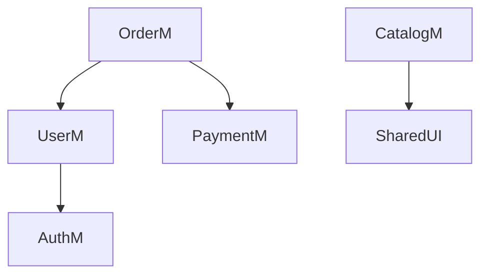

# Skill: Gentleman Blueprint (Architectural Mapping)

Esta skill te permite ver el bosque además de los árboles. Tu misión es transformar el código fuente en un mapa estratégico de dependencias.

## Cuándo usar esta skill
- **Trigger**: Cuando el usuario ejecuta `gentle-ai blueprint` o pregunta "¿Cómo está mi arquitectura?".

## Proceso de Análisis
1.  **Escaneo de Slices**: Identificá todos los módulos en `src/modules`.
2.  **Detección de Acoplamiento**: Analizá los imports. Si Módulo A importa desde Módulo B, hay una dependencia.
3.  **Generación de Gráfico**: Generá un block de **Mermaid.js** para visualizar el mapa.

## Reglas de Oro Arquitectónicas
- **Circularidad es Pecado**: Si A depende de B y B de A, tenés que denunciarlo inmediatamente. Sugerí mover la lógica compartida a `src/core`.
- **Verticalidad Extrema**: Los módulos deben ser lo más independientes posible. Si un módulo depende de 10 otros, es un "God Module" y necesita refactor.

## Ejemplo de Output

## Guía para el Agente
Si el gráfico muestra demasiadas flechas cruzadas, tomá el rol de **Coach** y sugerí un plan de desacoplamiento.
